# PCB Defect Detection: The MLOps Flywheel

This repository implements a production-grade MLOps ecosystem for automated PCB (Printed Circuit Board) defect detection. By integrating real-time inference, human-in-the-loop annotation, continuous monitoring, and automated CI/CD auditing, this project creates a "flywheel" effect—where every run makes the model smarter and the pipeline more robust.

---

## The Tech Stack

| Component | Technology | Role |
| :--- | :--- | :--- |
| **Detection** | [YOLOv8](https://ultralytics.com/) | State-of-the-art object detection for 6 defect types. |
| **Model Format** | [ONNX](https://onnx.ai/) | Universal, hardware-agnostic computation graph (resolves Mac vs Linux inference bugs). |
| **Inference API** | [FastAPI](https://fastapi.tiangolo.com/) | High-performance model serving (Port 8000) with integrated prediction logging. |
| **Frontend** | [Streamlit](https://streamlit.io/) | Interactive sandbox for real-time defect analysis (Port 8501). |
| **Orchestration** | [Docker Compose](https://www.docker.com/) | Unified management of all infrastructure services. |
| **Workflow / Monitoring**| [Airflow](https://airflow.apache.org/) | Workflow orchestration (Port 8085), automating label synchronization and scheduled data drift monitoring. |
| **Drift Monitoring** | [Evidently AI](https://www.evidentlyai.com/) | Live data drift evaluation & dashboard service (Port 8005). |
| **Tracking** | [MLflow](https://mlflow.org/) | Dual-instance tracking for Sandbox (5555) and Official (5556) runs. |
| **Annotation** | [Label Studio](https://labelstud.io/) | Active learning and dataset refinement (Port 8080). |
| **Versioning** | [DVC](https://dvc.org/) | Large data and model versioning with S3-compatible backends. |
| **Storage** | [RustFS](https://github.com/cloud-native-ml/rustfs) | Local S3-compatible object storage for model vaults. |
| **Reporting** | [CML](https://cml.dev/) | Automated performance reporting in GitHub PRs. |

---

## System Architecture

The diagram below shows every service, its port, and how data flows between infrastructure layers. Gold nodes mark the four **human-in-the-loop** decision points that gate automation.

```mermaid
%%{init: {'theme': 'base', 'themeVariables': {'fontSize': '13px'}}}%%
graph TB
    classDef human   fill:#FFD700,stroke:#8B6914,color:#1a1a1a,font-weight:bold
    classDef svc     fill:#DBEAFE,stroke:#2563EB,color:#1E3A5F
    classDef orch    fill:#DCFCE7,stroke:#16A34A,color:#14532D
    classDef track   fill:#FEF3C7,stroke:#D97706,color:#451A03
    classDef ghnode  fill:#1F2937,stroke:#6B7280,color:#F9FAFB
    classDef store   fill:#F3E8FF,stroke:#7C3AED,color:#2E1065
    classDef prnode  fill:#FEE2E2,stroke:#DC2626,color:#450A0A

    subgraph WS["Local Workstation  (Python — not Docker)"]
        direction LR
        STREAMLIT["Streamlit UI\n:8501"]:::svc
        FASTAPI["FastAPI Inference Server\n:8000"]:::svc
        RUNNER["GitHub Self-Hosted Runner"]:::svc
    end

    subgraph DOCKER["Docker Infrastructure"]
        direction TB
        AIRFLOW["Apache Airflow\n:8085\n(Orchestrator)"]:::orch
        subgraph MLF["Model Tracking"]
            MLFLOW_SB["MLflow Sandbox\n:5555  (dev)"]:::track
            MLFLOW_OFF["MLflow Official\n:5556  (team)"]:::track
        end
        LS["Label Studio\n:8080\n(Annotation)"]:::svc
        EV_UI["Evidently UI\n:8005\n(Drift Dashboard)"]:::svc
        RUSTFS["RustFS S3\n:9000 / :9001\n(Object Storage)"]:::store
    end

    subgraph GH["GitHub"]
        direction TB
        CICD["Actions CI/CD\n(ci.yml + deploy.yml)"]:::ghnode
        PR_TRAIN["Training PR\n+ CML Report"]:::prnode
        PR_DRIFT["Drift PR\n(retrain/drift-*)"]:::prnode
        PR_GOV["Governance PR\n(promote-model-v*)"]:::prnode
    end

    subgraph DATA["Data & Registry Layer"]
        direction LR
        DVC_DATA[("data/raw\nDVC tracked")]:::store
        PRED_LOG[("prediction_log.csv\n+ reference_predictions.csv")]:::store
        EV_WS[("monitoring/evidently_workspace")]:::store
        MODEL_REG[("MLflow Model Registry\n@staging  /  @champion")]:::store
    end

    H1["HUMAN IN THE LOOP\nAnnotates defect\nbounding boxes"]:::human
    H2["HUMAN IN THE LOOP\nReviews CML report,\nmerges Training PR"]:::human
    H3["HUMAN IN THE LOOP\nApproves Governance PR\n→ promotes @champion"]:::human
    H4["HUMAN IN THE LOOP\nReviews Evidently drift\nreport, initiates retrain"]:::human

    STREAMLIT -->|"uploads PCB image"| FASTAPI
    FASTAPI -->|"logs: confidence, bbox_area, pass_fail"| PRED_LOG
    FASTAPI -->|"polls @champion every 30 s (hot-reload)"| MODEL_REG
    FASTAPI -.->|"dev: sandbox runs"| MLFLOW_SB

    RUNNER -->|"triggers on PR / push"| CICD
    CICD -->|"dvc pull → dvc repro (train + eval)"| MLFLOW_OFF
    CICD -->|"posts visual report"| PR_TRAIN
    PR_TRAIN --- H2
    H2 -->|"merge to main"| CICD
    CICD -->|"export ONNX, register @staging"| MODEL_REG
    CICD -->|"trigger Airflow governance DAG"| AIRFLOW

    AIRFLOW -->|"sync_labels DAG: sync annotations"| LS
    AIRFLOW -->|"drift DAG: read prediction log"| PRED_LOG
    AIRFLOW -->|"drift DAG: write Evidently snapshots"| EV_WS
    AIRFLOW -->|"drift detected: create PR via GitHub API"| PR_DRIFT
    AIRFLOW -->|"model_eval DAG: test @staging model"| MODEL_REG
    AIRFLOW -->|"eval passed: create PR via GitHub API"| PR_GOV

    PR_DRIFT --- H4
    PR_GOV --- H3
    H3 -->|"merge governance PR"| CICD
    CICD -->|"deploy.yml: set @champion alias"| MODEL_REG

    LS --- H1
    H1 -->|"annotated YOLO labels → active_learning/"| DVC_DATA

    EV_UI -->|"reads workspace (browser refresh)"| EV_WS
    DVC_DATA <-->|"dvc push / pull"| RUSTFS
    MLFLOW_OFF <-->|"artifact storage"| RUSTFS
```



---

## Onboarding: Quick Start

### 1. Clone the Repository
```bash
git clone <repository_url>
cd pcb-defect-mlops-flywheel
```

### 2. Infrastructure Prerequisite (Docker)
This project uses a self-hosted CI/CD architecture. Before running any local scripts or triggering CI/CD, the environment must be configured and Docker Desktop must be running:

1. **Configure `.env`**: Ensure a `.env` file is present in the root directory and contains the `GITHUB_TOKEN` and `GITHUB_REPO` variables (required for Airflow to open Pull Requests).
2. **Launch the Infrastructure**:
```bash
docker compose --env-file .env -f docker/docker-compose.yml up -d
```
*Note: The self-hosted CI/CD runner communicates with these containers via localhost. If they are not running, the pipeline will fail its health checks.*

### 3. Access the Docker Infrastructure
The following core services are now running via Docker:
- **Airflow UI**: http://localhost:8085 (admin / admin)
- **MLflow (Sandbox)**: http://localhost:5555
- **MLflow (Official)**: http://localhost:5556
- **Label Studio**: http://localhost:8080 (Admin: admin@example.com / mlops123)
- **Evidently UI**: http://localhost:8005
- **RustFS S3 Console**: http://localhost:9001 (rustfsadmin / rustfsadmin)

*(Note: The FastAPI Server and Streamlit UI are run locally via Python scripts later in the workflow, not via Docker).*

### 4. Local Environment Setup
Initialize Python environment and download data:
```bash
# Initialize Virtual Environment & Install Dependencies (using UV)
uv sync
# (Optional) To manually activate the shell environment: source .venv/bin/activate

```

### 5. Start Local Python Services
The FastAPI backend and Streamlit frontend must be started in separate terminals:

```bash
# 1. Start FastAPI Inference Server
uv run python -m src.serving.serve
# API Docs available at: http://localhost:8000/docs

# 2. Start Streamlit Frontend (In a new terminal)
uv run python -m streamlit run src/app/main.py
# Sandbox UI available at: http://localhost:8501
```

### 6. Starting the Self-Hosted Runner (For CI/CD)
To use the automated GitHub CI/CD pipelines, a local runner is required:
1. Go to the GitHub repository -> **Settings** -> **Actions** -> **Runners**.
2. Click **New self-hosted runner** and follow the instructions to download and configure it.
3. Start the runner in a separate terminal:
   ```bash
   ./run.sh
   ```

---

## The Complete MLOps Flywheel Workflow

The pipeline runs as a continuous four-phase loop. Every retrain strengthens the model; every annotation improves the data. Gold nodes below mark **human approval gates** — automation cannot advance without them.

```mermaid
%%{init: {'theme': 'base', 'themeVariables': {'fontSize': '13px'}}}%%
flowchart TD
    classDef human    fill:#FFD700,stroke:#8B6914,color:#1a1a1a,font-weight:bold
    classDef auto     fill:#DBEAFE,stroke:#2563EB,color:#1E3A5F
    classDef decision fill:#FEF9C3,stroke:#CA8A04,color:#451A03
    classDef phase    fill:#F0FDF4,stroke:#16A34A,color:#14532D,font-weight:bold
    classDef terminal fill:#F0FDF4,stroke:#16A34A,color:#14532D

    FLYWHEEL(["MLOps Flywheel — entry point\nnew data  or  drift detected"]):::terminal

    subgraph P1["Phase 1 — Train & Validate"]
        direction TB
        PR_OPEN["Developer opens Pull Request\n(updated params.yaml or new data)"]:::auto
        CI_TRAIN["CI/CD: dvc pull from RustFS\n→ dvc repro  (preprocess + train + eval)\n→ log metrics to MLflow Official :5556"]:::auto
        CML_RPT["Post CML report to PR:\nConfusion Matrix, F1, PR-curve + MLflow links"]:::auto
        H2["HUMAN IN THE LOOP\nReview CML report and metrics diff vs main\nRequest changes  OR  approve merge"]:::human
        MERGE_DEC{"Approve\nmerge?"}:::decision
        MERGE["Merge to main branch"]:::auto
        REG_STAGING["CI/CD: export ONNX → register in MLflow\nApply @staging alias"]:::auto
    end

    subgraph P2["Phase 2 — Model Governance"]
        direction TB
        EVAL_DAG["Airflow: model_governance_eval DAG\ntriggered by CI/CD after push to main"]:::auto
        EVAL_RUN["Fetch @staging from MLflow\nRun evaluate_staging_model.py\nagainst golden validation set"]:::auto
        EVAL_DEC{"Passes\nevaluation?"}:::decision
        GOV_PR["Airflow creates Governance PR\nupdates deployment-repo/production_version.json\nvia GitHub API"]:::auto
        H3["HUMAN IN THE LOOP\nReview Governance PR\nVerify safety, accuracy, compliance\nApprove promotion to Production"]:::human
        GOV_DEC{"Approve\npromotion?"}:::decision
        CHAMPION["deploy.yml: set @champion alias in MLflow\nFastAPI hot-reloads within 30 s"]:::auto
    end

    subgraph P3["Phase 3 — Serve & Monitor"]
        direction TB
        SERVE["FastAPI :8000 loads @champion from MLflow\nStreamlit UI :8501 for interactive inference"]:::auto
        INFER["Production inference:\nPCB image → YOLO defect detection → PASS / FAIL"]:::auto
        LOG["Log per-request metrics to prediction_log.csv:\navg_confidence, avg_bbox_area, pass_fail"]:::auto
        DRIFT_DAG["Airflow: daily data_sync_and_drift_check DAG\nread last 100 rows of prediction_log.csv"]:::auto
        EV_RUN["Evidently AI: compute Data Drift Report\nvs reference_predictions.csv baseline\nfeatures: avg_confidence, avg_bbox_area, pass_fail"]:::auto
        EV_SAVE["Save HTML + JSON drift report\nregister snapshot in Evidently Workspace\nvisible in Evidently UI :8005"]:::auto
        DRIFT_DEC{"≥50% features\ndrifted?"}:::decision
        DRIFT_PR["Airflow creates Drift PR  (retrain/drift-*)\nattaches Evidently HTML report via GitHub API"]:::auto
        H4["HUMAN IN THE LOOP\nInspect Evidently drift report in PR\nReview confidence trend and failure rate shift\nDecide: retrain now  or  continue monitoring"]:::human
        RETRAIN_DEC{"Approve\nretrain?"}:::decision
    end

    subgraph P4["Phase 4 — Active Learning & Data Refinement"]
        direction TB
        COLLECT["Collect unseen / drifted PCB images\nfrom production or simulation directory"]:::auto
        UPLOAD["Upload images to Label Studio\nor use Streamlit active-learning loop"]:::auto
        H1["HUMAN IN THE LOOP\nAnnotate defect bounding boxes in Label Studio\n(open, short, mousebite, spur, pin_hole, spurious_copper)"]:::human
        SYNC_DAG["Airflow sync_labels DAG:\ndownload annotations from Label Studio API\nconvert to YOLO format  (idempotent — marks tasks synced)"]:::auto
        DVC_PUSH["dvc add data/raw  →  dvc push to RustFS S3\ngit commit dvc.lock  →  open Pull Request"]:::auto
    end

    FLYWHEEL --> PR_OPEN
    PR_OPEN --> CI_TRAIN --> CML_RPT --> H2 --> MERGE_DEC
    MERGE_DEC -- "Reject — request changes" --> PR_OPEN
    MERGE_DEC -- "Approve" --> MERGE --> REG_STAGING
    REG_STAGING --> EVAL_DAG --> EVAL_RUN --> EVAL_DEC
    EVAL_DEC -- "Fail — tag failed, skip governance" --> EVAL_DAG
    EVAL_DEC -- "Pass — tag passed" --> GOV_PR --> H3 --> GOV_DEC
    GOV_DEC -- "Reject" --> EVAL_DAG
    GOV_DEC -- "Approve and merge" --> CHAMPION
    CHAMPION --> SERVE --> INFER --> LOG
    LOG --> DRIFT_DAG --> EV_RUN --> EV_SAVE --> DRIFT_DEC
    DRIFT_DEC -- "No drift — keep serving" --> INFER
    DRIFT_DEC -- "Drift detected" --> DRIFT_PR --> H4 --> RETRAIN_DEC
    RETRAIN_DEC -- "Not now — keep monitoring" --> INFER
    RETRAIN_DEC -- "Yes — retrain" --> COLLECT
    COLLECT --> UPLOAD --> H1 --> SYNC_DAG --> DVC_PUSH --> PR_OPEN
```



### Human-in-the-Loop Gates

| Gate | Triggered by | Human decision |
|:--|:--|:--|
| **H1 — Annotation** | New images uploaded to Label Studio | Draw bounding boxes for all 6 defect classes; label quality directly determines model quality |
| **H2 — Training PR review** | CI/CD posts CML report on Pull Request | Accept or reject model performance against main by reviewing confusion matrix and F1 curves |
| **H3 — Governance approval** | Airflow opens Governance PR after @staging passes evaluation | Final safety gate before production; merging this PR is what promotes the model to @champion |
| **H4 — Drift retraining decision** | Airflow opens Drift PR when Evidently detects significant distribution shift | Decide whether the detected drift warrants a full retrain or if monitoring should continue |

---

### Phase 1: Training and Validation
Pull the raw data from local S3 storage:
```bash
dvc pull
```

**Execution Strategies:**
- **Fast Iteration (Flexible)**: Developers can manually run `uv run python src/training/train.py` for quick debugging. This bypasses DVC and logs directly to the local Sandbox MLflow (Port 5555).
- **Pipeline Verification (Recommended)**: Before opening a Pull Request, verify your `params.yaml` is set correctly, then run `dvc repro` locally. Since CI/CD relies strictly on `params.yaml`, any command-line flags you used during fast iteration will be ignored by the CI pipeline! 
- **Adding New Data (Strict)**: If you added new images, you **must** update the dataset pointer before pushing:
  ```bash
  dvc commit data/raw
  dvc push
  ```

```bash
# Execute the strict pipeline before committing
dvc repro

# Commit the updated contract!
git add dvc.lock params.yaml
```

- **Local Dev**: Logs results to Port 5555 (Local Sandbox MLflow).
- **CI/CD Retraining**: Logs results to Port 5556 (Official Team MLflow). The retraining pipeline triggers automatically whenever a Pull Request is opened or updated.
  The CI pipeline dynamically resolves the branch, runs `dvc repro`, and posts a visual report (Confusion Matrix, F1-Curves) as a PR comment.
- **Merge to Main**: When the PR is merged to `main`, the CI pipeline automatically exports the model to the **ONNX format**, registers the `best.onnx` artifact to the MLflow Model Registry, and applies the `@staging` alias. This guarantees the model will run flawlessly on any CPU architecture.

### Phase 2: Model Governance & GitOps Promotion
Before a model reaches production, it must pass governance:
- **Automated Evaluation**: The Airflow `model_evaluation_dag` fetches the `@staging` model from MLflow and runs simulated tests.
- **Governance PR**: If the model passes, Airflow automatically creates a Pull Request updating the `deployment-repo/production_version.json` file.
- **Promotion to Champion**: Once a human approves and merges the Governance PR, a GitHub Action automatically updates the MLflow Registry, promoting the model to `@champion`.

### Phase 3: Serving and Monitoring
Deploy the champion model to the FastAPI server for real-time inference. The server continuously logs prediction metrics to `monitoring/prediction_log.csv` for drift analysis.
```bash
# Serves the champion model from the MLflow registry
uv run python -m src.serving.serve
```
- **Data Drift Detection**: Data drift is calculated using Evidently AI.
- **Airflow Automation**: The `data_sync_and_drift_check_dag` synchronizes annotations from Label Studio and analyzes live FastAPI prediction logs against the baseline using Evidently AI. If significant drift is detected, it flags the system for retraining.

### Phase 4: Active Learning and Refinement
To refine the model using active learning:
1. Upload new "unseen" or drifted PCB images to Label Studio.
2. Use the Active Learning Loop in the Streamlit UI to identify high-uncertainty cases.
3. Sync refined labels back to the repo (`src/utils/sync_labels.py`).
4. Return to Phase 1 (Open a Pull Request to incorporate new data).

---

## Repository Structure
- `src/app/`: Streamlit dashboard for real-time detection.
- `src/serving/`: FastAPI inference service logic and prediction logger.
- `src/training/`: YOLOv8 training and evaluation scripts.
- `src/monitoring/`: Data drift detection, monitoring scripts, and baseline generation using Evidently AI.
- `src/utils/`: Label Studio sync and batch inference helpers.
- `dags/`: Airflow DAGs for drift monitoring and synchronization tasks.
- `docker/`: Unified Docker Compose configuration (FastAPI, MLflow, Label Studio, RustFS, Airflow).
- `mlflow-official-history/`: Committed history of team-verified runs.
- `mlflow-history/`: Private local sandbox history (ignored by Git).

---

## Best Practices
- **Never Commit data/raw**: Always use `dvc push` to store large images in RustFS.
- **Official Runs**: Only the CI/CD pipeline should log to Port 5556 to keep the "Official Showroom" clean.
- **PR Reports**: Always review the CML report in the Pull Request before merging to main.

---
**Developed for the ZHAW MLOps Course (Spring 2026)**