# PCB Defect Detection — MLOps Architecture & Flow Diagrams

---

## Diagram 1: System Architecture

> All services, their ports, data flows, and human-in-the-loop touchpoints (gold nodes).

```mermaid
%%{init: {'theme': 'base', 'themeVariables': {'fontSize': '13px'}}}%%
graph TB
    classDef human   fill:#FFD700,stroke:#8B6914,color:#1a1a1a,font-weight:bold
    classDef svc     fill:#DBEAFE,stroke:#2563EB,color:#1E3A5F
    classDef orch    fill:#DCFCE7,stroke:#16A34A,color:#14532D
    classDef track   fill:#FEF3C7,stroke:#D97706,color:#451A03
    classDef ghnode  fill:#1F2937,stroke:#6B7280,color:#F9FAFB
    classDef store   fill:#F3E8FF,stroke:#7C3AED,color:#2E1065
    classDef prnode  fill:#FEE2E2,stroke:#DC2626,color:#450A0A

    %% ── Developer Workstation ──────────────────────────────────────────────
    subgraph WS["🖥️  Local Workstation  (Python — not Docker)"]
        direction LR
        STREAMLIT["Streamlit UI\n:8501"]:::svc
        FASTAPI["FastAPI Inference Server\n:8000"]:::svc
        RUNNER["GitHub Self-Hosted Runner"]:::svc
    end

    %% ── Docker Infrastructure ─────────────────────────────────────────────
    subgraph DOCKER["🐳  Docker Infrastructure"]
        direction TB
        AIRFLOW["Apache Airflow\n:8085\n(Orchestrator)"]:::orch

        subgraph MLF["Model Tracking"]
            MLFLOW_SB["MLflow Sandbox\n:5555  (dev)"]:::track
            MLFLOW_OFF["MLflow Official\n:5556  (team)"]:::track
        end

        LS["Label Studio\n:8080\n(Annotation)"]:::svc
        EV_UI["Evidently UI\n:8005\n(Drift Dashboard)"]:::svc
        RUSTFS["RustFS S3\n:9000 / :9001\n(Object Storage)"]:::store
    end

    %% ── GitHub ────────────────────────────────────────────────────────────
    subgraph GH["  GitHub"]
        direction TB
        CICD["Actions CI/CD\n(ci.yml + deploy.yml)"]:::ghnode
        PR_TRAIN["Training PR\n+ CML Report\n(Confusion Matrix, F1)"]:::prnode
        PR_DRIFT["Drift PR\n(retrain/drift-*)"]:::prnode
        PR_GOV["Governance PR\n(promote-model-v*)"]:::prnode
    end

    %% ── Data & Registry ──────────────────────────────────────────────────
    subgraph DATA["💾  Data & Registry Layer"]
        direction LR
        DVC_DATA[("data/raw\nDVC tracked")]:::store
        PRED_LOG[("prediction_log.csv\n+ reference_predictions.csv")]:::store
        EV_WS[("monitoring/evidently_workspace")]:::store
        MODEL_REG[("MLflow Model Registry\n@staging  /  @champion")]:::store
    end

    %% ── Human-in-the-Loop Nodes ──────────────────────────────────────────
    H1["👤 HUMAN IN THE LOOP\nAnnotates defect\nbounding boxes"]:::human
    H2["👤 HUMAN IN THE LOOP\nReviews CML report,\nmerges Training PR"]:::human
    H3["👤 HUMAN IN THE LOOP\nApproves Governance PR\n→ promotes @champion"]:::human
    H4["👤 HUMAN IN THE LOOP\nReviews Evidently drift\nreport, initiates retrain"]:::human

    %% ── Connections ───────────────────────────────────────────────────────
    STREAMLIT -->|"uploads PCB image"| FASTAPI
    FASTAPI -->|"logs: confidence,\nbbox_area, pass_fail"| PRED_LOG
    FASTAPI -->|"polls @champion\nevery 30 s (hot-reload)"| MODEL_REG
    FASTAPI -.->|"dev: sandbox runs"| MLFLOW_SB

    RUNNER -->|"triggers on PR / push"| CICD
    CICD -->|"dvc pull → dvc repro\n(train + evaluate)"| MLFLOW_OFF
    CICD -->|"posts visual report"| PR_TRAIN
    PR_TRAIN --- H2
    H2 -->|"merge to main"| CICD
    CICD -->|"export ONNX, register @staging"| MODEL_REG
    CICD -->|"trigger Airflow\ngovernance DAG via API"| AIRFLOW

    AIRFLOW -->|"sync_labels DAG:\nsync annotations"| LS
    AIRFLOW -->|"drift DAG:\nread prediction log"| PRED_LOG
    AIRFLOW -->|"drift DAG:\nwrite Evidently snapshots"| EV_WS
    AIRFLOW -->|"drift detected:\ncreate PR via GitHub API"| PR_DRIFT
    AIRFLOW -->|"model_eval DAG:\ntest @staging model"| MODEL_REG
    AIRFLOW -->|"eval passed:\ncreate PR via GitHub API"| PR_GOV

    PR_DRIFT --- H4
    PR_GOV --- H3
    H3 -->|"merge governance PR"| CICD
    CICD -->|"deploy.yml: read\nproduction_version.json\nset @champion alias"| MODEL_REG

    LS --- H1
    H1 -->|"annotated YOLO labels\n→ active_learning/"| DVC_DATA

    EV_UI -->|"reads workspace\n(browser refresh)"| EV_WS

    DVC_DATA <-->|"dvc push / pull"| RUSTFS
    MLFLOW_OFF <-->|"artifact storage"| RUSTFS
```

---

## Diagram 2: MLOps Flywheel — End-to-End Flow

> The four-phase production cycle. Gold nodes = human decisions that gate automation.

```mermaid
%%{init: {'theme': 'base', 'themeVariables': {'fontSize': '13px'}}}%%
flowchart TD
    classDef human    fill:#FFD700,stroke:#8B6914,color:#1a1a1a,font-weight:bold
    classDef auto     fill:#DBEAFE,stroke:#2563EB,color:#1E3A5F
    classDef decision fill:#FEF9C3,stroke:#CA8A04,color:#451A03
    classDef phase    fill:#F0FDF4,stroke:#16A34A,color:#14532D,font-weight:bold
    classDef terminal fill:#F0FDF4,stroke:#16A34A,color:#14532D

    FLYWHEEL([" ♻ MLOps Flywheel — entry point\n(new data  or  drift detected) "]):::terminal

    %% ─────────────────────────────────────────────────────────────────────
    subgraph P1["Phase 1 — Train & Validate"]
        direction TB
        P1_LABEL["[ CI/CD Pipeline — GitHub Actions + self-hosted runner ]"]:::phase
        PR_OPEN["Developer opens Pull Request\n(with updated params.yaml or data)"]:::auto
        CI_TRAIN["CI/CD: dvc pull from RustFS\n→ dvc repro  (preprocess + train + eval)\n→ log metrics to MLflow Official :5556"]:::auto
        CML_RPT["Post CML report to PR:\nConfusion Matrix, F1, PR-curve\n+ MLflow deep links"]:::auto
        H2["👤 HUMAN IN THE LOOP\nReview CML report & metrics diff vs main\nRequest changes  OR  approve merge"]:::human
        MERGE_DEC{"Approve\nmerge?"}:::decision
        MERGE["Merge to main branch"]:::auto
        REG_STAGING["CI/CD (on push to main):\nExport ONNX → register in MLflow\nApply @staging alias"]:::auto
    end

    %% ─────────────────────────────────────────────────────────────────────
    subgraph P2["Phase 2 — Model Governance (Airflow)"]
        direction TB
        P2_LABEL["[ Airflow DAG: model_governance_eval ]"]:::phase
        EVAL_DAG["Airflow triggered by CI/CD\nafter successful push to main"]:::auto
        EVAL_RUN["Fetch @staging from MLflow\nRun evaluate_staging_model.py\nagainst golden validation set"]:::auto
        EVAL_DEC{"Passes\nevaluation?"}:::decision
        GOV_PR["Airflow creates Governance PR\nUpdates deployment-repo/production_version.json\nvia GitHub API (no git needed in container)"]:::auto
        H3["👤 HUMAN IN THE LOOP\nReview Governance PR\nVerify safety, accuracy, compliance\nApprove promotion to Production"]:::human
        GOV_DEC{"Approve\npromotion?"}:::decision
        CHAMPION["deploy.yml triggered on merge:\nSet @champion alias in MLflow Registry\nFastAPI hot-reloads within 30 s"]:::auto
    end

    %% ─────────────────────────────────────────────────────────────────────
    subgraph P3["Phase 3 — Serve & Monitor"]
        direction TB
        P3_LABEL["[ FastAPI :8000  +  Airflow daily DAG ]"]:::phase
        SERVE["FastAPI loads @champion from MLflow\nStreamlit UI :8501 for interactive inference"]:::auto
        INFER["Production inference:\nPCB image → YOLO defect detection\nPASS / FAIL decision returned"]:::auto
        LOG["Log per-request metrics to prediction_log.csv:\navg_confidence, avg_bbox_area, pass_fail"]:::auto
        DRIFT_DAG["Airflow: daily  data_sync_and_drift_check DAG\nRead last 100 rows of prediction_log.csv"]:::auto
        EV_RUN["Evidently AI:\nCompute Data Drift Report\nvs reference_predictions.csv baseline\nFeatures: avg_confidence, avg_bbox_area, pass_fail"]:::auto
        EV_SAVE["Save HTML + JSON drift report\nRegister snapshot in Evidently Workspace\n→ visible in Evidently UI :8005"]:::auto
        DRIFT_DEC{"≥50% features\ndrifted?"}:::decision
        DRIFT_PR["Airflow creates Drift PR  (retrain/drift-*)\nvia GitHub API\nIncludes Evidently HTML report in branch"]:::auto
        H4["👤 HUMAN IN THE LOOP\nInspect Evidently drift report in PR\nReview avg_confidence trend and failure rate shift\nDecide: retrain now  or  continue monitoring"]:::human
        RETRAIN_DEC{"Approve\nretrain?"}:::decision
    end

    %% ─────────────────────────────────────────────────────────────────────
    subgraph P4["Phase 4 — Active Learning & Data Refinement"]
        direction TB
        P4_LABEL["[ Label Studio :8080  +  Airflow sync_labels DAG ]"]:::phase
        COLLECT["Collect unseen / drifted PCB images\nfrom production or simulation directory"]:::auto
        UPLOAD["Upload images to Label Studio\nor use Streamlit active-learning loop\n(identify high-uncertainty cases)"]:::auto
        H1["👤 HUMAN IN THE LOOP\nAnnotate defect bounding boxes\nin Label Studio UI\n(open, short, mousebite, spur, pin_hole, spurious_copper)"]:::human
        SYNC_DAG["Airflow sync_labels DAG:\nDownload annotations from Label Studio API\nConvert to YOLO format (normalized cx,cy,w,h)\nMark tasks synced  (idempotent)"]:::auto
        DVC_PUSH["Developer:\ndvc add data/raw  →  dvc push to RustFS S3\ngit commit dvc.lock  →  open Pull Request"]:::auto
    end

    %% ─────────────────────────────────────────────────────────────────────
    %% Connections
    FLYWHEEL --> PR_OPEN
    PR_OPEN --> CI_TRAIN --> CML_RPT --> H2 --> MERGE_DEC
    MERGE_DEC -- "❌ Request changes" --> PR_OPEN
    MERGE_DEC -- "✅ Approve" --> MERGE --> REG_STAGING

    REG_STAGING --> EVAL_DAG --> EVAL_RUN --> EVAL_DEC
    EVAL_DEC -- "❌ Fail — tag 'failed'\n    skip governance" --> EVAL_DAG
    EVAL_DEC -- "✅ Pass — tag 'passed'" --> GOV_PR --> H3 --> GOV_DEC
    GOV_DEC -- "❌ Reject" --> EVAL_DAG
    GOV_DEC -- "✅ Approve & merge" --> CHAMPION

    CHAMPION --> SERVE --> INFER --> LOG
    LOG --> DRIFT_DAG --> EV_RUN --> EV_SAVE --> DRIFT_DEC
    DRIFT_DEC -- "No drift\n→ keep serving" --> INFER
    DRIFT_DEC -- "Drift\ndetected" --> DRIFT_PR --> H4 --> RETRAIN_DEC
    RETRAIN_DEC -- "Not now\n→ keep monitoring" --> INFER
    RETRAIN_DEC -- "Yes:\nretrain" --> COLLECT

    COLLECT --> UPLOAD --> H1 --> SYNC_DAG --> DVC_PUSH --> PR_OPEN
```

---

### Human-in-the-Loop Summary

| Gate | Where | What the human decides |
|:--|:--|:--|
| **H1 — Annotation** | Label Studio :8080 | Draw bounding boxes on raw PCB images; quality of labels directly determines model quality |
| **H2 — Training PR review** | GitHub Pull Request | Accept or reject model performance by reviewing CML confusion matrix and F1 vs main |
| **H3 — Governance approval** | GitHub Governance PR | Final safety gate before a model reaches production; approving this merge promotes @champion |
| **H4 — Drift retraining decision** | GitHub Drift PR | Decide whether detected drift warrants a retrain cycle or if monitoring should continue |
