<!-- _class: title -->

# PCB Defect Detection
## The MLOps Flywheel

Project in Machine Learning Operations
ZHAW · Spring 2026

Bhatia Isha · Chaurasia Vikas · Duss Karin · Müller Jonathan

---

# Project Goal

**Automate PCB quality control** using a self-reinforcing MLOps pipeline.

- Detect **6 defect types** on printed circuit boards:
  `open` · `short` · `mousebite` · `spur` · `spurious_copper` · `pin_hole`
- Build a **flywheel** — every production run generates data that improves the next model
- Full **human-in-the-loop** governance: no model reaches production without human approval

### Why this matters
> Manual PCB inspection is slow, expensive, and error-prone.
> An automated, self-improving system reduces defect escape rates over time.

---

# System Architecture

---

# Tech Stack

| Stage | Tools | Purpose |
| :--- | :--- | :--- |
| **Data & Versioning** | DVC · RustFS (S3) · Git · GitHub | Dataset versioning, reproducible pulls |
| **Model Training** | YOLOv8 · ONNX · Python | Train and export hardware-agnostic model |
| **CI/CD & Reporting** | GitHub Actions · Self-hosted Runner · CML | Automated training on PRs, visual reports |
| **Experiment Tracking** | MLflow (dual instance) | Sandbox :5555 dev · Official :5556 CI/CD |
| **Orchestration** | Airflow | Governance eval · label sync · drift check |
| **Drift Detection** | Evidently AI | Statistical monitoring of production predictions |
| **Annotation** | Label Studio | Human labelling of low-confidence images |
| **Serving & Frontend** | FastAPI · Streamlit · Docker Compose | ONNX inference API + interactive sandbox |

---

# Phase 1 — Training Pipeline

> CI/CD runs strictly from `params.yaml` — local flags ignored · ONNX export on merge to `main`

---

# Phase 2 — Model Governance

> FastAPI polls MLflow every 30 s and hot-reloads when a new `@champion` is detected

---

# Phase 3 — Serving & Drift Monitoring

> Airflow DAG runs daily: ① sync_labels from Label Studio · ② drift_monitor with Evidently AI

---

# Phase 4 — Active Learning

> Every low-confidence prediction eventually improves the model — the flywheel is self-reinforcing

---

# CI/CD Workflow

> Self-hosted runner bridges GitHub Actions with local Docker infrastructure (MLflow, RustFS, Airflow)

---

# Human-in-the-Loop Gates

Four checkpoints — **no model reaches production without a human merge**

| Gate | Where | Decision |
| :--- | :--- | :--- |
| **H1 — Annotation** | Label Studio | Draw bounding boxes on low-confidence images |
| **H2 — Training PR** | GitHub PR + CML report | Review confusion matrix & F1 · approve or reject |
| **H3 — Governance PR** | GitHub PR | Safety gate — merge promotes `@champion` |
| **H4 — Retraining PR** | GitHub Drift PR | Decide if detected drift warrants a retrain |

 

> No champion is set without a human merge.
> No retraining happens without a human decision.

---

# Demo

**Services running locally via Docker Compose:**

| Service | URL |
|:---|:---|
| Streamlit — interactive defect sandbox | `http://localhost:8501` |
| FastAPI — inference API + Swagger docs | `http://localhost:8000/docs` |
| Airflow — DAG orchestration | `http://localhost:8085` |
| MLflow Official — experiment tracking | `http://localhost:5556` |
| Evidently AI — drift dashboard | `http://localhost:8005` |
| Label Studio — annotation UI | `http://localhost:8080` |
| RustFS S3 — data & model storage | `http://localhost:9001` |

---

<!-- _class: dark -->

# Key Takeaways

- **Flywheel design**: drift → annotation → retrain → better model → less drift
- **Three Airflow DAGs** orchestrate all automation: governance, sync+drift, deploy
- **Four human gates** ensure no model reaches production unchecked
- **ONNX format** eliminates Mac vs Linux inference discrepancies
- **Dual MLflow** keeps sandbox experiments separate from official CI/CD runs
- **Self-hosted runner** bridges GitHub Actions with local Docker infrastructure

 

*Bhatia Isha · Chaurasia Vikas · Duss Karin · Müller Jonathan*
*ZHAW — Machine Learning and Data in Operations · Spring 2026*
