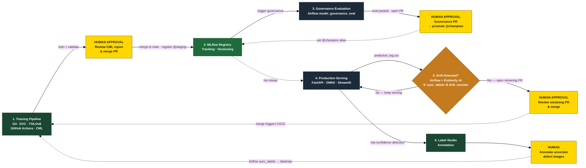

<!-- _class: title -->

<div class="left">

# PCB Defect Detection System

## Machine Learning and Data in Operations
## Spring, 2026

<div class="names">Bhatia Isha · Chaurasia Vikas · Duss Karin · Müller Jonathan</div>

</div>

---

# Why Automate PCB Inspection?

<div class="two-col">

<div class="box box-problem">
<div class="box-label problem">THE PROBLEM</div>

- Manual inspection is slow and labor-intensive
- Human error rates reach **20–30%** in high-volume production
- Defects cause costly product recalls and field failures
- No scalable real-time feedback loop for quality control

</div>

<div class="box">
<div class="box-label solution">OUR SOLUTION</div>

- Automated, sub-second visual defect detection
- YOLOv8 replacing human variance
- End-to-end MLOps pipeline for versioning and reproducibility
- Active Learning data flywheel

</div>

</div>

---

# Concept

| | |
|:---|:---|
| **Input** | High-resolution PCB images — from production-line cameras or manual uploads |
| **Core Task** | Detect and classify 6 defect types: `open` · `short` · `mousebite` · `spur` · `spurious_copper` · `pin_hole` |
| **Output** | Defect class, bounding box location, confidence score, and PASS / FAIL decision |

<br>

> **Business value** — Faster inspection, fewer escaped defects, reduced labor cost, and more consistent quality than manual inspection

---

# Tools & Tech Stack

| Stage | Tools | Purpose |
| :--- | :--- | :--- |
| **Data** | DVC · RustFS (S3) | Version datasets, reproducible pulls |
| **Model Development** | YOLOv8 · ONNX · Python | Train & export hardware-agnostic detection model |
| **Experiment Tracking** | MLflow (dual instance) | Sandbox dev runs vs official CI/CD runs |
| **CI / CD** | GitHub Actions · Self-hosted Runner · CML | Automated training on PRs, visual reports |
| **Deployment** | FastAPI · Docker Compose | ONNX inference API with prediction logging |
| **Frontend** | Streamlit | Interactive defect sandbox |
| **Labeling** | Label Studio | Human-in-the-loop annotation |
| **Orchestration** | Airflow | Governance eval · label sync · drift monitoring |
| **Drift Detection** | Evidently AI | Statistical monitoring of production predictions |

---

# End-to-End MLOps Architecture



---

# Phase 1 — Training & CI/CD

**Triggered by:** Pull Request opened or updated

- GitHub Actions (self-hosted runner) runs the full pipeline:
  `dvc pull` → `dvc repro` → preprocess → YOLOv8 train → evaluate
- Metrics logged to **MLflow Official** (:5556)
- **CML** posts confusion matrix + F1 curves as a PR comment

<span class="human">👤 HUMAN GATE</span> &nbsp;Review CML report → merge to main → `@staging` registered in MLflow

| Mode | Where it logs | When to use |
|:---|:---|:---|
| `uv run python src/training/train.py` | Sandbox MLflow :5555 | Fast local iteration |
| `dvc repro` + open PR | Official MLflow :5556 | Before any merge |

> CI/CD runs **strictly from `params.yaml`** — command-line flags used locally are ignored by the pipeline

---

# Phase 2 — Model Governance

**Triggered by:** push to `main` after PR merge

```
@staging in MLflow
       │
       ▼
Airflow: model_governance_eval DAG
  evaluate_staging_model.py  ──► golden validation set
       │
  ┌────┴────┐
 FAIL      PASS
  │          │
tag:failed  tag:passed → create_governance_pr()
skip                         │
                    GitHub PR: update production_version.json
                             │
```

<span class="human">👤 HUMAN GATE</span> &nbsp;Review Governance PR → merge → `deploy.yml` sets `@champion` alias

> FastAPI polls MLflow every 30 s and hot-reloads when a new `@champion` is detected

---

# Phase 3 — Serving & Drift Monitoring

**FastAPI** serves `@champion` via ONNX · logs every prediction to `monitoring/prediction_log.csv`

**Airflow `data_sync_and_drift_check` DAG** — runs daily:

| Step | What it does |
| :--- | :--- |
| ① `sync_labels` | Pull completed annotations from Label Studio → `data/raw/active_learning/` |
| ② `drift_monitor` | Read last 100 rows of prediction log · run Evidently AI report |

**Features monitored by Evidently AI:**

| Feature | What a shift means |
|:---|:---|
| `avg_confidence` | Model seeing unfamiliar patterns |
| `avg_bbox_area` | Camera setup or PCB layout changed |
| `pass_fail` | Population-level failure rate shifted |

<span class="human">👤 HUMAN GATE</span> &nbsp;If ≥ 50% features drifted → Airflow opens retraining PR → human merges to trigger CI/CD

---

# Phase 4 — Active Learning

**Closing the flywheel:** low-confidence predictions become tomorrow's training data

```
FastAPI: defect detected but low confidence
                 │
                 ▼
         Label Studio (annotation queue)
```

<span class="human">👤 HUMAN GATE</span> &nbsp;Annotate bounding boxes for 6 defect classes in Label Studio

```
Airflow sync_labels DAG (daily)
  ① Download completed annotations via Label Studio API
  ② Convert to YOLO format  (cx, cy, w, h  normalised)
  ③ Write to  data/raw/active_learning/
                 │
                 ▼
  dvc add data/raw  →  dvc push  →  open PR  →  Phase 1
```

> Every uncertain prediction eventually improves the model — the flywheel is self-reinforcing

---

# Human-in-the-Loop Gates

Four checkpoints — **no model reaches production without a human merge**

| Gate | Where | Decision |
| :--- | :--- | :--- |
| **H1 — Annotation** | Label Studio | Draw bounding boxes on low-confidence PCB images |
| **H2 — Training PR** | GitHub PR + CML report | Accept or reject model: review confusion matrix and F1 vs main |
| **H3 — Governance PR** | GitHub Governance PR | Final safety gate before production — merge promotes `@champion` |
| **H4 — Retraining PR** | GitHub Drift PR | Decide whether detected drift warrants a full retrain cycle |

<br>

> No retraining happens without a human decision.
> No champion is set without a human merge.

---

# Demo

**Services running locally via Docker Compose:**

| Service | URL |
|:---|:---|
| Streamlit — interactive defect sandbox | `http://localhost:8501` |
| FastAPI — inference API + Swagger docs | `http://localhost:8000/docs` |
| Airflow — DAG orchestration | `http://localhost:8085` |
| MLflow Official — experiment tracking | `http://localhost:5556` |
| Evidently AI — drift dashboard | `http://localhost:8005` |
| Label Studio — annotation UI | `http://localhost:8080` |
| RustFS S3 — data & model storage | `http://localhost:9001` |

---

<!-- _class: dark -->

# Key Takeaways

- **Flywheel design** — drift → annotation → retrain → better model → less drift
- **Three Airflow DAGs** — governance eval, label sync + drift check, deploy
- **Four human gates** — no model reaches production unchecked
- **ONNX format** — eliminates Mac vs Linux inference discrepancies
- **Dual MLflow** — keeps sandbox experiments separate from official CI/CD runs
- **Self-hosted runner** — bridges GitHub Actions with local Docker infrastructure

<br>

*Bhatia Isha · Chaurasia Vikas · Duss Karin · Müller Jonathan*
*ZHAW — Machine Learning and Data in Operations · Spring 2026*
